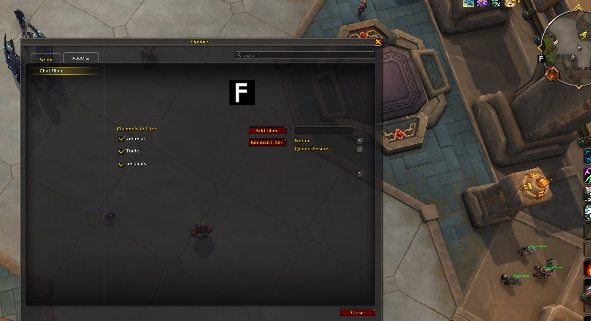

# Install

- Download ChatFilter.zip
- Unzip it inside _retail_/Interface/AddOns

# Options

- Click icon (Big F) in minimap to open options
- Write in chat `/cf` to open options

# Usage

- You can select 3 channels to filter messages: general, trade and services
- You can add or remove words in the filter list
- Persistent data between sessions

# Screenshots

